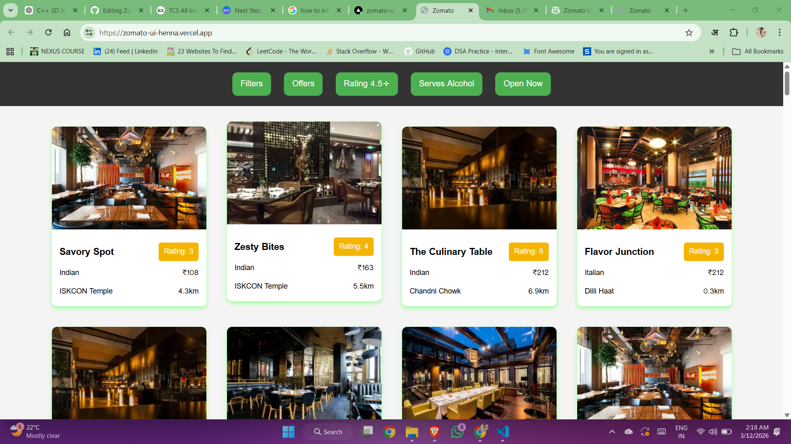

# 🍽️ Zomato UI Clone

A front-end clone of the popular food delivery platform **Zomato**, built using vanilla **HTML**, **CSS**, and **JavaScript**. 
This project replicates the restaurant listing interface with interactive filtering and sorting capabilities.

## 🚀 Live Demo

🔗 [zomato-ui-henna.vercel.app](https://zomato-ui-henna.vercel.app) 

## 📸 Screenshot


<!-- Replace the path above with an actual screenshot image path -->

## ✨ Features

- **Restaurant Cards** — Beautifully designed cards displaying restaurant name, image, cuisine type, price, rating, location, and distance.
- **Filter Popup** — Interactive filter dialog with multiple sorting options:
  - Sort by Rating
  - High to Low (Price)
  - Cost: Low to High
  - Distance
- **Quick Filter Buttons** — One-click filters for:
  - 🏷️ Offers
  - ⭐ Rating 4.5+
  - 🍷 Serves Alcohol
  - 🟢 Open Now
- **Hover Effects** — Smooth card lift animation on hover for a modern UI feel.
- **Responsive Layout** — Flexbox-based card grid that wraps across different screen sizes.

## 🛠️ Tech Stack

| Technology | Purpose |
|------------|---------|
| **HTML5** | Page structure and semantic markup |
| **CSS3** | Styling, layout (Flexbox), animations, and responsive design |
| **JavaScript** | Dynamic card rendering, filtering logic, and DOM manipulation |

## 📂 Project Structure

```
Zomato_UI/
├── Images/          # Restaurant images and assets
├── index.html       # Main HTML page
├── style.css        # Stylesheet for layout and design
└── app.js           # JavaScript logic for rendering cards and filters
```

## 🏁 Getting Started

1. **Clone the repository**
   ```bash
   git clone https://github.com/Shobharam07/Zomato_UI.git
   ```
2. **Navigate to the project folder**
   ```bash
   cd Zomato_UI
   ```
3. **Open in browser**
   ```bash
   open index.html
   ```
   Or simply open `index.html` in your preferred browser.

## 🙌 Contributing

Contributions, issues, and feature requests are welcome! Feel free to open an issue or submit a pull request.

## 📄 License

This project is open source and available for personal and educational use.

---

⭐ **If you found this project helpful, give it a star!**
